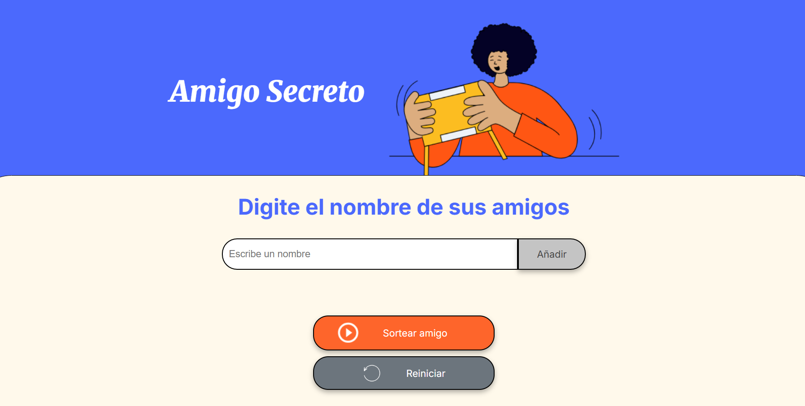
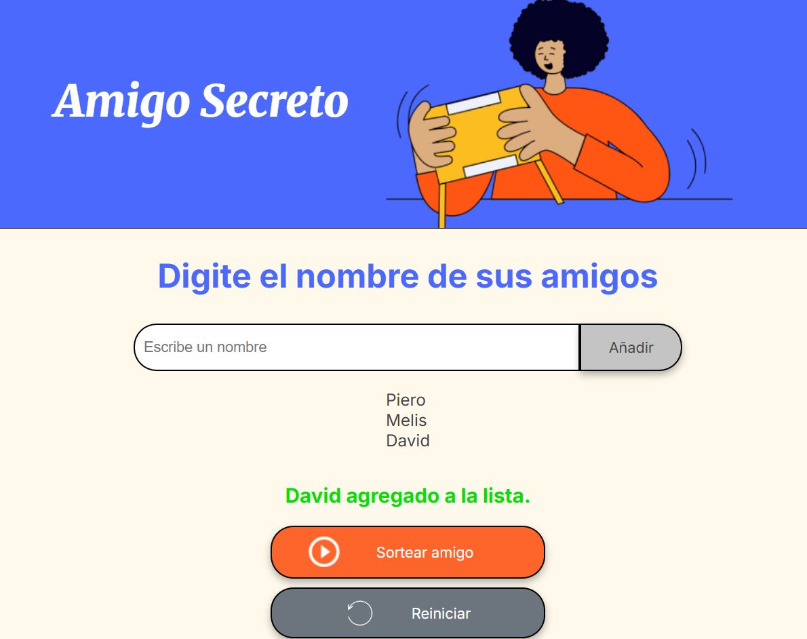
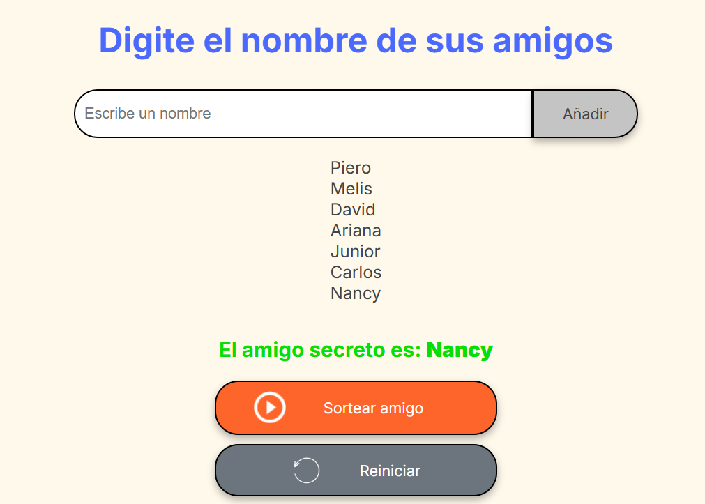
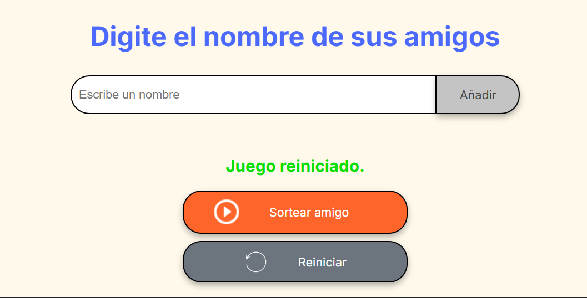

<!-- Título + imagen portada -->
<h1 align="center">Challenge Amigo Secreto</h1>
<p align="center">
  
</p>

---

## Índice

- [Descripción del proyecto](#-descripción-del-proyecto)  
- [Estado del proyecto](#-estado-del-proyecto)  
- [Características / funcionalidades](#-características--funcionalidades)  
- [Demostraciones / capturas](#-demostraciones--capturas)  
- [Instalación y uso](#-instalación-y-uso)  
- [Tecnologías utilizadas](#-tecnologías-utilizadas)  
- [Autor](#-autor)  

---

## Descripción del proyecto

Amigo Secreto es una aplicación web sencilla pero funcional que permite:

- Ingresar nombres de amigos.  
- Validar que los nombres no estén vacíos ni repetidos.  
- Mostrar la lista actual de amigos en pantalla.  
- Realizar un sorteo aleatorio para elegir el amigo secreto.  
- Reiniciar el juego para comenzar de nuevo.

Este proyecto fue desarrollado como parte de un **challenge de programación**, con énfasis en lógica con JavaScript, manipulación del DOM y buenas prácticas de código.

---

## Estado del proyecto

Proyecto **completo y funcional**.  
Aunque cumple con todas las funciones principales, se pueden agregar mejoras futuras como animaciones, persistencia con `localStorage`, estilos responsivos más complejos, etc.

---

## Características / funcionalidades

- Agregar amigos mediante un campo de texto.  
- Validaciones:  
  • No se aceptan nombres vacíos.  
  • No se permiten duplicados.  
- Mostrar lista actualizada de amigos con elementos `<li>`.  
- Sortear aleatoriamente un amigo secreto con mensajes dinámicos.  
- Reiniciar el juego (limpiar lista, input y resultado).  
- Mensajes de feedback para el usuario (errores, confirmaciones, etc.).

---

## Demostraciones / capturas

  
*Pantalla principal con input para agregar amigos.*

  
*RAgregando nombres a la lista, para el sorteo.*

  
*Resultado del sorteo mostrando el nombre seleccionado.*

  
*Vista luego de reiniciar: lista vacía, campo limpio y mensaje de reinicio.*

---

## Instalación y uso

1. Clona este repositorio:  
   ```bash
   git clone https://github.com/tu-usuario/amigo-secreto.git

2. Entra a la carpeta del proyecto:
   ```bash
   cd amigo-secreto
3. Abre index.html en tu navegador (doble clic o usando servidor local).

4. Ingresa nombres, haz clic en “Añadir”, luego en “Sortear amigo” para ver el resultado.

5. Usa el botón “Reiniciar” para empezar de nuevo.

## Tecnologías utilizadas

- HTML5 — estructura de la página.

- CSS3 — estilos visuales, variables, diseño.

- JavaScript (ES6+) — lógica del juego, validaciones y manipulación del DOM.

## Autor
- Proyecto desarrollado por Piero García
- GitHub: @pierog08

